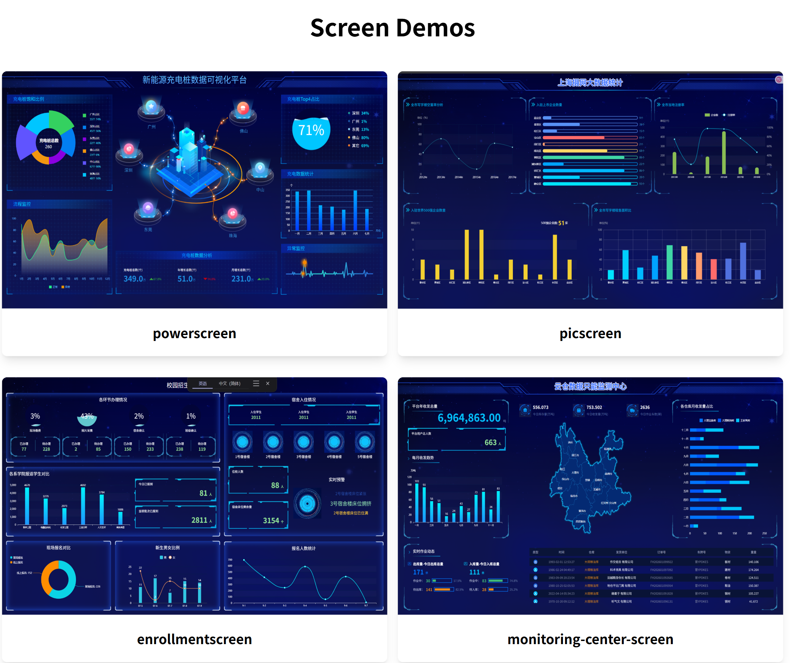

<h1 align="center">screen-demos</h1>

可视化大屏案例，用于练习大屏代码能力。UI来源于网络，只作为练习使用不做他用。

使用 [asrv](https://windyeasy.github.io/asrv/) 进行接口的模拟

## demo



## 运行项目

使用node 16.0及以上的版本

### 安装依赖

```sh
pnpm install
```

### 编译重新加载开发

```sh
pnpm run dev

# 使用 asrv 生成模拟接口
pnpm run server
```

## 提交方法

由于使用了husky + commitlint对提交进行验证，需要使用如下几种方法提交

- 方法一：

```shell
pnpm run commit
```

- 方法二：提交时直接使用规范的格式

```shell
git commit -m "feat: 添加一个新特性"
```

## License

screen-demos is [MIT](./LICENSE).
